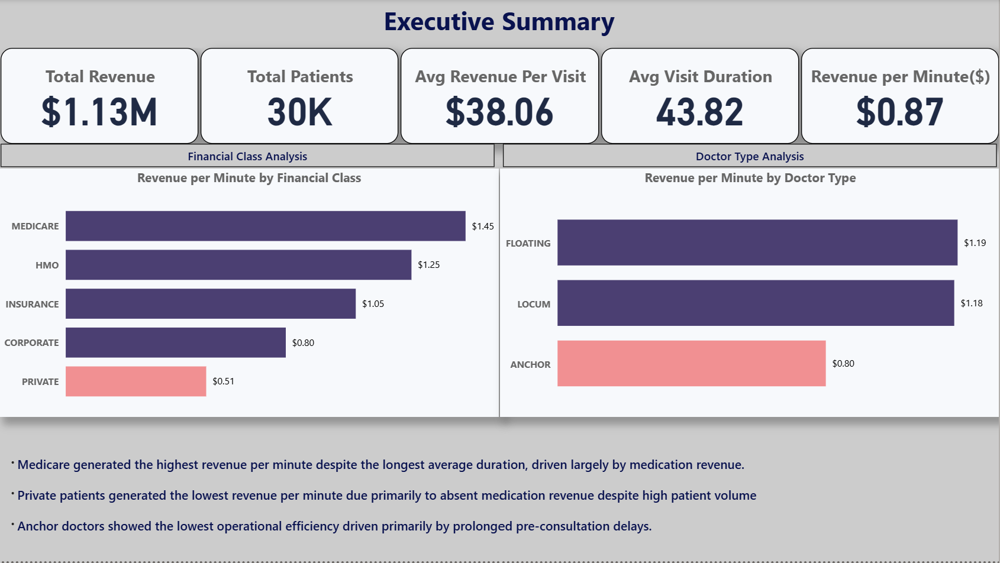
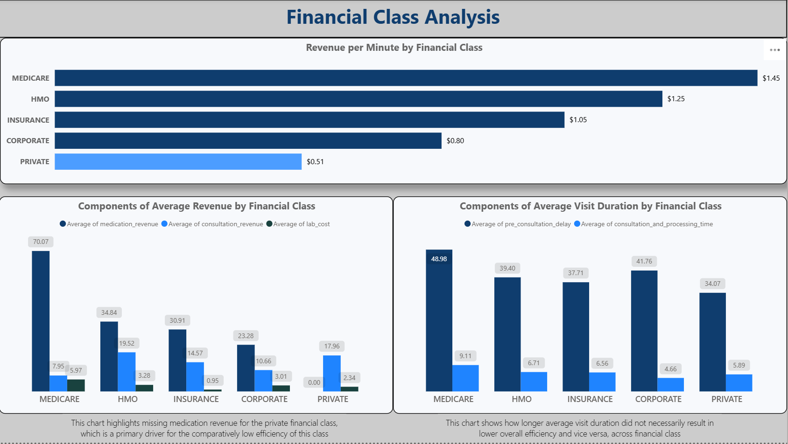
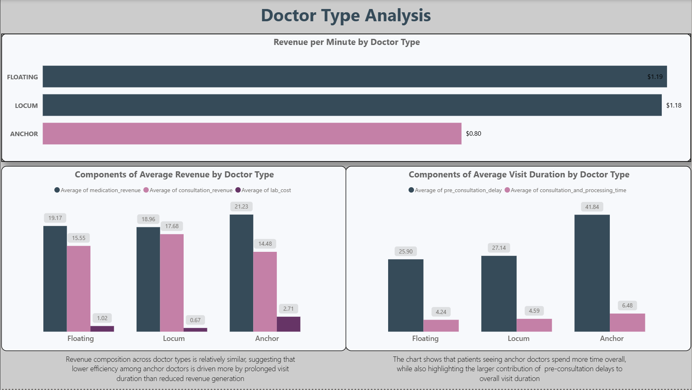

# Hospital Operational Efficiency Analysis

## Project Overview 
This project analyzes hospital operational efficiency using patient workflow and revenue data. The objective was to identify the financial and operational factors driving efficiency differences across financial classes and doctor types.

Efficiency was defined as Revenue per Minute, a metric that combines both revenue generation and patient visit duration to evaluate how effectively hospital resources are being utilized.

## Business Objective 
To identify the operational and financial factors influencing hospital efficiency by examining revenue generation and visit duration patterns across different financial classes and doctor types.

## Dataset 
The dataset contains 29,998 patient encounters and includes:

### Dimensions
- Patient Type
- Financial Class
- Doctor Type

### Temporal Variables
•	Date
•	Entry Time
•	Post Consultation Time
•	Completion Time

### Revenue Variables
•	Medication Revenue
•	Consultation Revenue
•	Lab Cost
Note: According to the dataset documentation, "Lab Cost" represents charges paid by patients rather than true operational costs. Therefore, this analysis focuses on revenue efficiency rather than profitability.

## Tools Used 

### Excel
•	Data cleaning
•	Derived metrics
•	Pivot table analysis

### SQL (SQLite)
•	Aggregation
•	Grouping
•	Efficiency calculations

### Power BI
•	Interactive dashboard development
•	Executive reporting
•	Visual storytelling

## Methodology 

### Data Preparation
•	Removed duplicate records
•	Validated chronological consistency of workflow timestamps
•	Converted time variables for duration calculations
•	Replaced structured missing medication revenue values with zero
•	Treated sparse lab cost values as zero
•	Created operational duration metrics

 ### Derived Metrics
•	Total Revenue
•	Total Visit Duration
•	Pre-Consultation Delay
•	Consultation & Processing Time
•	Revenue per Minute

**Revenue per Minute** was used as the primary efficiency metric:
Revenue per Minute = Total Revenue / Total Visit Duration

## Key Findings 

### Financial Class

#### Private Patients 
•	Lowest revenue per minute
•	Least efficient financial class
•	Driven primarily by absence of medication revenue

#### Medicare
•	Highest revenue per minute
•	Most efficient financial class
•	Achieved highest efficiency despite longest average visit duration due to significantly higher medication revenue

### Doctor Type

#### Anchor Doctors
•	Lowest revenue per minute
•	Least efficient doctor group
•	Inefficiency driven primarily by prolonged pre-consultation delays

## Recommendations

### Private Patients
Investigate the absence of medication revenue to determine whether it reflects data quality issues or operational challenges related to medication purchases.

### Medicare
Study practices associated with Medicare patients to identify strategies that could improve efficiency in other financial classes.

### Anchor Doctors
Review workflow processes contributing to prolonged pre-consultation delays and identify opportunities to improve patient throughput.

## Dashboard Preview

### Executive Summary 

### Financial Class Analysis

### Doctor Type Analysis

## Limitations 
Dataset appears partially synthetic and may not fully reflect real-world hospital operations.
True operational cost data were unavailable.
Only outpatient encounters were included.
Findings should therefore be interpreted as illustrative of analytical methodology rather than definitive operational conclusions.

## Files Included
•	Microsoft Excel file 
•	SQL file
•	Power BI dashboard
•	Microsoft Word Report
•	Images

